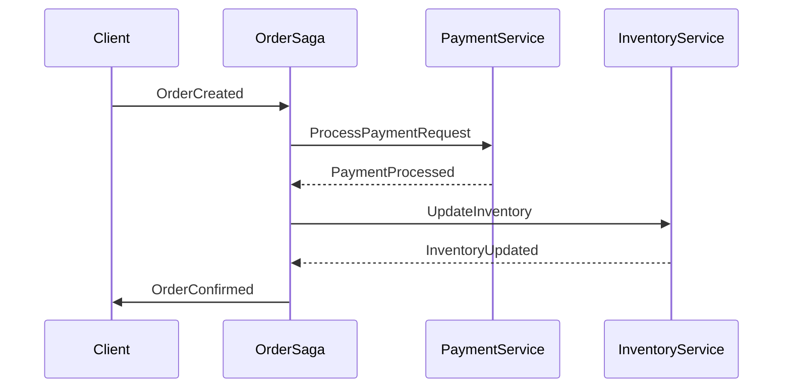
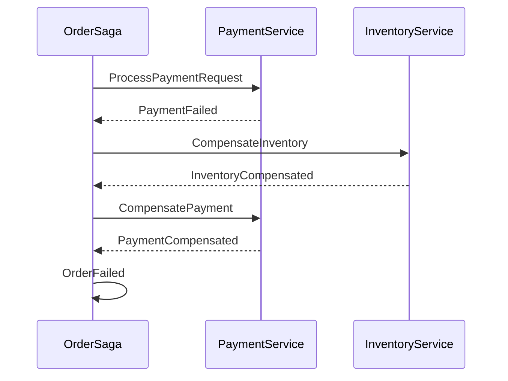
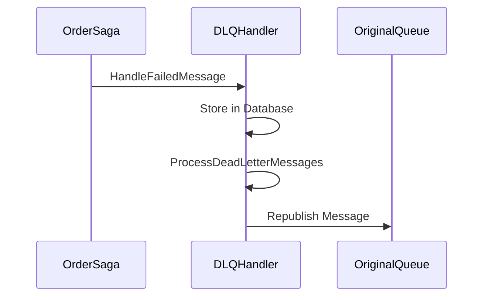

# Saga Orchestrator

## Overview

Saga Orchestrator là một microservice được thiết kế để quản lý và điều phối các giao dịch phân tán trong hệ thống đặt hàng. Nó sử dụng mô hình Saga Pattern để đảm bảo tính nhất quán của dữ liệu trong môi trường phân tán.

## Kiến trúc

### Saga Pattern
- **Choreography-based Saga**: Sử dụng MassTransit để điều phối các event giữa các service
- **State Machine**: Quản lý trạng thái của saga thông qua MassTransit State Machine
- **Persistence**: Lưu trữ trạng thái saga trong PostgreSQL

### Các thành phần chính
1. **OrderSaga**: State Machine chính quản lý luồng xử lý đơn hàng
2. **Dead Letter Queue Handler**: Xử lý các message thất bại
3. **Resilience Policies**: Các chính sách xử lý lỗi và retry
4. **Health Checks**: Giám sát trạng thái của hệ thống

## Luồng nghiệp vụ

### 1. Tạo đơn hàng


### 2. Xử lý lỗi và Compensation


### 3. Dead Letter Queue


## Các trạng thái của Saga

1. **Initial State**
   - Chờ event OrderCreated
   - Khởi tạo thông tin đơn hàng

2. **OrderReceived**
   - Đã nhận đơn hàng
   - Chờ xử lý thanh toán

3. **PaymentCompleted**
   - Thanh toán thành công
   - Chờ cập nhật kho

4. **OrderCompleted**
   - Đơn hàng hoàn tất
   - Kết thúc saga

5. **PaymentFailed**
   - Thanh toán thất bại
   - Bắt đầu compensation

6. **InventoryFailed**
   - Cập nhật kho thất bại
   - Bắt đầu compensation

7. **OrderFailed**
   - Đơn hàng thất bại
   - Đang thực hiện compensation

## Các Event

### Event chính
- `OrderCreated`: Khởi tạo đơn hàng
- `PaymentProcessed`: Xử lý thanh toán
- `InventoryUpdated`: Cập nhật kho

### Event Compensation
- `PaymentCompensated`: Hoàn tiền
- `InventoryCompensated`: Hoàn trả hàng
- `OrderCompensated`: Hủy đơn hàng

## Cấu hình

### RabbitMQ
```json
{
  "RabbitMq": {
    "Host": "localhost",
    "Port": 5672,
    "UserName": "guest",
    "Password": "guest"
  }
}
```

### PostgreSQL
```json
{
  "ConnectionStrings": {
    "DefaultConnection": "Host=localhost;Port=5432;Database=SagaDb;Username=postgres;Password=postgres"
  }
}
```

## Health Checks

Hệ thống cung cấp các health check endpoint:
- `/health`: Kiểm tra tổng thể
- `/health/database`: Kiểm tra kết nối database
- `/health/rabbitmq`: Kiểm tra kết nối RabbitMQ
- `/health/sagas`: Kiểm tra trạng thái các saga

## Xử lý lỗi

### Retry Policy
- Số lần thử lại: 3
- Khoảng thời gian giữa các lần thử: 5 phút

### Circuit Breaker
- Số lỗi tối đa: 3
- Thời gian mở mạch: 30 giây

### Dead Letter Queue
- Lưu trữ message thất bại
- Tự động thử lại
- Gửi cảnh báo khi thất bại nhiều lần

## Monitoring

### Logging
- Log level: Information
- Format: JSON
- Các thông tin được log:
  - Event được xử lý
  - Trạng thái saga
  - Lỗi xảy ra
  - Thông tin compensation

### Metrics
- Số lượng saga đang hoạt động
- Tỷ lệ thành công/thất bại
- Thời gian xử lý trung bình
- Số lượng message trong DLQ

## Development

### Yêu cầu
- .NET 8.0
- PostgreSQL 15+
- RabbitMQ 3.12+

### Cài đặt
1. Clone repository
2. Cài đặt dependencies
3. Cấu hình connection strings
4. Chạy migrations
5. Khởi động service

### Testing
- Unit tests cho các thành phần
- Integration tests cho luồng nghiệp vụ
- Performance tests cho các scenario

## Deployment

### Docker
```bash
docker build -t saga-orchestrator .
docker run -d -p 8080:80 saga-orchestrator
```

### Kubernetes
```yaml
apiVersion: apps/v1
kind: Deployment
metadata:
  name: saga-orchestrator
spec:
  replicas: 3
  template:
    spec:
      containers:
      - name: saga-orchestrator
        image: saga-orchestrator:latest
        ports:
        - containerPort: 80
```

## Contributing

1. Fork repository
2. Tạo branch mới
3. Commit changes
4. Push lên branch
5. Tạo Pull Request

## License

MIT License